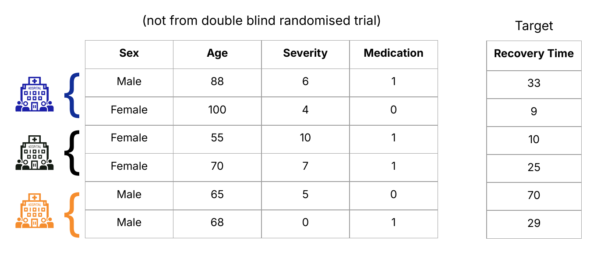
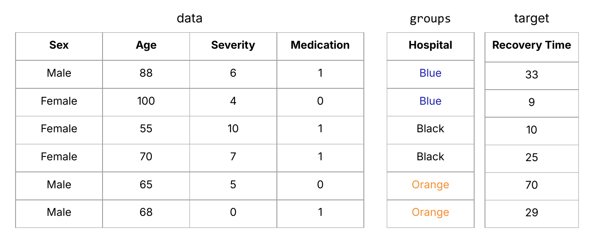
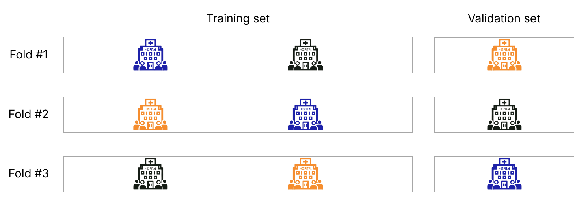
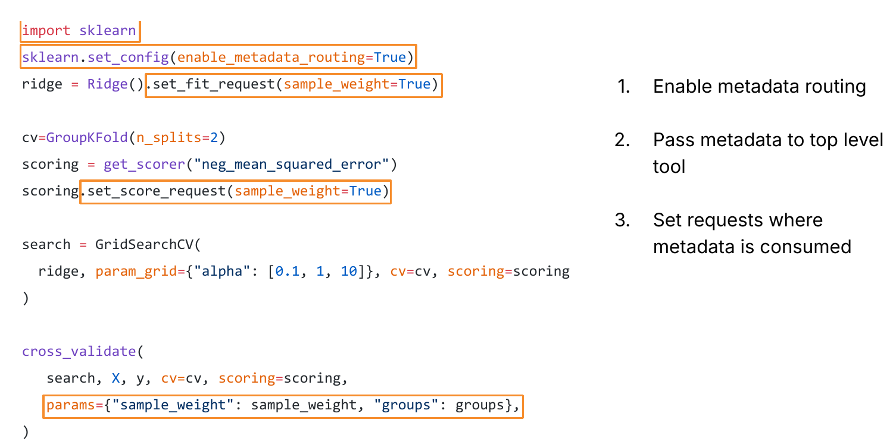

# An Update on scikit-learn’s Metadata Routing API

*Based on a talk given at EuroSciPy 2026 in Kraków. Metadata routing has been introduced gradually in experimental mode since scikit-learn 1.3; coverage is now almost complete, and the feature is mature enough that many users can try it in real workflows.*

---

## What is metadata routing?

In scikit-learn, **metadata** is data you want to apply *on top of* your tabular features and your target. It influences how a function treats `X` and `y`.

You may be familiar with two common examples from scikit-learn: `sample_weight`
and `groups`. Other libraries such as [fairlearn](https://fairlearn.org) expose their
own kinds of metadata, and you can define custom metadata to be used in a business
logic, for instance. The benefit of using metadata is usually not a higher score on the
model, but a **more realistic model** to begin with.

**Routing** is the mechanism that passes that metadata between several components of a pipeline to where it is actually used (“consumed”). Before the routing API, that was only possible in limited cases. With routing enabled, you can pass `sample_weight` and `groups` through nested meta-estimators, combine third-party objects with scikit-learn estimators while still forwarding their metadata, and define custom metrics, scorers, and estimators that consume metadata you invent yourself.

| Without routing (`enable_metadata_routing=False`, default) | With routing (`enable_metadata_routing=True`) |
| --- | --- |
| Restricted use of `sample_weight` and `groups` | `sample_weight` and `groups` can be used in nested structures |
| Metadata from other libraries cannot be passed through scikit-learn objects| scikit-learn objects can route metadata to objects from other libraries |
| Local use only of custom metadata | Custom metadata can be routed to custom functions and methods |

The Metadata Routing API is a potent and flexible tool that allows users to define in detail where their metadata gets used. It enables new use cases and enhanced integration of third party libraties with scikit-learn. Adoption is spreading in the ecosystem, for example in [fairlearn](https://fairlearn.org) , [imbalanced-learn](https://imbalanced-learn.org/stable), [skada](https://github.com/scikit-adaptation/skada), [skorch](https://skorch.readthedocs.io), and [skfolio](https://skfolio.org).

---

## Metadata in the wild

Let's tutorial-style walk you through an example.

Imagine a medical study on the effectiveness of a new treatment. Here we have observational data that is getting used in that study. Features include sex, age, severity, and whether a patient received a medication; the target is the recovery time. This data is naturally biased, because it does *not* come from a randomised trial. It entails all the imbalance and structure that usually implies.



Patients come from different hospitals that differ in systematic factors such as medical devices, policies, and socioeconomic mix of patients. That hospital identity is useful for evaluation, but it is not a feature we necessarily want the model to treat like age or severity. Instead we keep it as **groups** with shape `(n_samples,)`, but separate from `X`.

During cross-validation we want a realistic estimate of how well a model can generalise. If samples from the same hospital appear in both the training and validation fold, the model can look better than it will on a new hospital. When patterns that contribute to the predicted target are being trained on, we call this [data leakage](https://en.wikipedia.org/wiki/Leakage_(machine_learning)).

Instead of allowing data to be leaked, we create a metadata called **groups**, that we pass into cross validation.



scikit-learn's `GroupKFold` keeps each group entirely in train *or* validation for a given fold:



This has worked in scikit-learn for a long time when you pass `groups` into `cross_validate` together with a grouped splitter:

```python
from sklearn.model_selection import GroupKFold, cross_validate
from sklearn.linear_model import Ridge

ridge = Ridge()
cv = GroupKFold(n_splits=2)
cross_validate(ridge, X, y, cv=cv, groups=groups)
```

Going back to our example, `sample_weight`, on the other hand, draws the model’s attention toward (or away from) particular samples. If biases we see in our patient data set refer to how features are distributed or relate to one-another, we can use `sample_weight` as a fix.

If we suspect that the race, age or socioeconomic status of a patient determined if they got the new treatment at all, `sample_weight` can re-balance the over- or under-representation of a certain group of patients and draw the model to emphasise on reducing training error on the higher weighted samples more.

In practice, since `Ridge.fit` can consume `sample_weight`, you might reasonably try:

```python
cross_validate(ridge, X, y, cv=cv, sample_weight=sample_weight)
```

…and hit a wall:

```text
TypeError: got an unexpected keyword argument 'sample_weight'
```

Prior to the metadata routing API, `cross_validate` did not know how to forward arbitrary metadata into `fit`. The same limitation blocked metadata from many third-party libraries when combined with scikit-learn’s cross-validation tools.

If we want fairer, less leaky models to predict the treatment effect for future patients, we need metadata to move through several layers of other tools on purpose.

That's why in practice you often nest further: you want to `cross_validate` a `GridSearchCV` that tunes `Ridge`, with a scorer that can also take `sample_weight`, and a `GroupKFold` that needs `groups`. That never worked. Calling a function that uses a metadata from another effectively broke it's ability to accept that metadata.

Metadata routing API was build to bridge exactly this gap: you can use it to get your metadata to the functions that know how to consume it.

---

## Using the metadata routing API

With metadata routing, the code stays close to what you already know. The orange boxed snippets show you what you need to add to take advantage of the routing in experimental mode:



1. **Enable** the experimental feature. `set_config(enable_metadata_routing=True)` turns routing on. Disable it when you no longer need it.
2. **Pass** metadata once at the top-level tool (here `cross_validate`). That top-level object could also be a `Pipeline` or a meta-estimator (an estimator that takes another estimator as an argument).
3. **Request** metadata where it should be consumed, with `set_{method}_request(...)` (`set_fit_request`, `set_score_request`, and so on). Grouped splitters such as `GroupKFold` already request `groups` by design, so you do not set that yourself.

This is the core mental model: **pass at the top, request at the leaves**.

---

## Pipelines that transform validation sets

Metadata routing also unlocks a new feature that was impossible before and rescues data scientists from awkward workarounds: **validation sets that are transformed alongside `X`** in a `Pipeline`.

Some estimators such as `HistGradientBoostingClassifier` split off a validation set *inside* `fit` for validating early stopping. If used in a `Pipeline` with preprocessing steps that were applied on the full matrix, that internal split leaks information from the train set into the validation set. Validation data should be split *before* transformation, then run through the same steps as training `X`.

`Pipeline`’s `transform_input` parameter (introduced in version 1.6) allows users to define metadata that should be transformed along with `X` until a step consumes it. [LightGBM](https://lightgbm.readthedocs.io/en/latest/index.html) estimators are now compatible with this API. [XGBoost](https://xgboost.readthedocs.io/en/stable) does not support `transform_input` yet at the time of writing.

The new feature allows users to pass a validation set of their liking through a `Pipeline`, for instancy by performing a `train_test_split` beforehand:

![Pipeline with transform_input=['X_val'] and HistGradientBoostingClassifier.set_fit_request(X_val=True, y_val=True)](blogpost_images/fig06_transform_input.png)

Here `X_val` is transformed like `X_train` at every pipeline step until `HistGradientBoostingClassifier.fit` consumes it for early stopping.

---

## Recent updates and ongoing work

Metadata routing is still marked experimental, but it is **pretty mature** in practice. Recent and upcoming work includes:

- `TargetEncoder` can use group splitters ([#33089](https://github.com/scikit-learn/scikit-learn/pull/33089))
- Metadata (particularly `X_val` and `y_val`) can be used inside callbacks (e.g. `ScoringMonitor`) ([#34137](https://github.com/scikit-learn/scikit-learn/issues/34137))
- A developer API for third-party libraries ([#34314](https://github.com/scikit-learn/scikit-learn/issues/34314))
- **Default requests**, so users don't need explicit `set_*_request` for common cases ([#31413](https://github.com/scikit-learn/scikit-learn/issues/31413))
- Visualisation and debugging tools for metadata routing ([#31535](https://github.com/scikit-learn/scikit-learn/issues/31535))

For custom business metrics and scorers, the explicit request API remains the flexible path even once defaults improve.

---

## Takeaway

Metadata routing turns “please somehow get this array into the right nested `fit`/`predict`/`score` call” into a deliberate contract: pass values at the top, request them where they are consumed. This unlocks many new use cases and a tighter integration of scikit-learn compatible libraries in the ecosystem. The API is still experimental by flag, but worth trying if your real data are grouped, weighted, or otherwise richer than `(X, y)`.

---

## References

### Metadata routing (scikit-learn)

- [Metadata Routing user guide](https://scikit-learn.org/stable/metadata_routing.html)
- [Developing estimators compliant with metadata routing](https://scikit-learn.org/stable/auto_examples/miscellaneous/plot_metadata_routing.html) (developer-oriented)
- [SLEP006 / metadata routing task list](https://github.com/scikit-learn/scikit-learn/issues/22893)
- Adrin Jalali, [*Revenue based scoring in `GridSearchCV`: a case for the new metadata routing in scikit-learn*](https://pretalx.com/pycon-lithuania-2024/talk/LHNGSS/) (PyCon Lithuania 2024)
- Stefanie Senger, [*Scikit-learn’s Metadata Routing API*](https://pretalx.com/euroscipy-2026/talk/VXRSM8/) (EuroSciPy 2026)

### Use cases for `sample_weight`

- Vincent Warmerdam, [:probabl. Whiteboard Series — Improving models via subsets](https://www.youtube.com/watch?v=REIg5NH2SNc)
- Florian Wilhelm, [*Causal Inference and Propensity Score Methods*](https://florianwilhelm.info/2017/04/causal_inference_propensity_score/) (IPTW with scikit-learn)

### Related GitHub threads mentioned above

- [#33089](https://github.com/scikit-learn/scikit-learn/pull/33089) — `TargetEncoder` and group splitters  
- [#34137](https://github.com/scikit-learn/scikit-learn/issues/34137) — metadata and callbacks / `ScoringMonitor`  
- [#34314](https://github.com/scikit-learn/scikit-learn/issues/34314) — developer API for metadata routing  
- [#31413](https://github.com/scikit-learn/scikit-learn/issues/31413) — default requests  
- [#31535](https://github.com/scikit-learn/scikit-learn/issues/31535) — visualisation and debugging tools  
